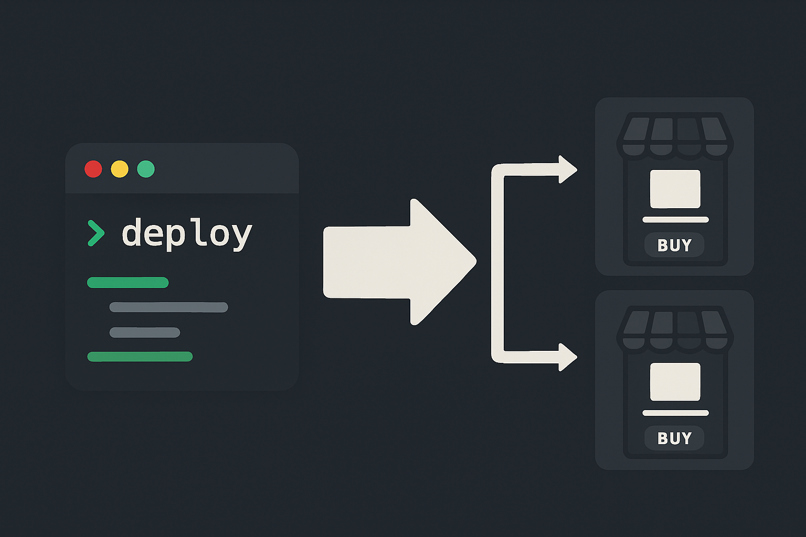

# Shopify Theme Multi-Store Deployer



A Node.js CLI tool that deploys Shopify theme code to multiple stores simultaneously using the Shopify CLI.

[](https://badge.fury.io/js/shopify-theme-deployer)
[](https://opensource.org/licenses/MIT)

## Installation

```bash
npm install -g shopify-theme-deployer
```

## Quick Start

```bash
# 1. Create configuration file
shopify-deploy --init

# 2. Edit stores.json with your store URLs and theme IDs

# 3. Authenticate with your stores
shopify auth login --store your-store.myshopify.com

# 4. Deploy to all stores
shopify-deploy
```

## Features

### Core Features

- **Multi-store deployment**: Deploy to multiple Shopify stores with a single command
- **Selective deployment**: Deploy to specific stores or all stores
- **JSON configuration**: Simple JSON-based store configuration
- **Shopify CLI integration**: Uses official Shopify CLI for secure authentication
- **Cross-platform**: Works on Windows, macOS, and Linux

### Advanced Features

- **Parallel deployments**: Deploy to multiple stores simultaneously for faster execution
- **Auto-retry with exponential backoff**: Automatically retry failed deployments with intelligent timing
- **Theme backup**: Backup themes before deployment to prevent data loss
- **Dry-run mode**: Preview deployments without making actual changes
- **Rate limiting protection**: Built-in delays to respect Shopify API limits
- **Comprehensive error handling**: Intelligent error detection with helpful suggestions

### User Experience

- **Colored output**: Easy-to-read console output with color coding
- **Loading indicators**: Visual progress feedback during operations
- **Detailed logging**: Comprehensive logs with timestamps for debugging
- **Verbose mode**: Detailed output for troubleshooting
- **Continue on error**: Option to continue deploying even if some stores fail

## Configuration

### Store Configuration

Create a `stores.json` file (or use `shopify-deploy --init`):

```json
{
  "stores": [
    {
      "url": "your-production-store.myshopify.com",
      "theme_id": "123456789012"
    },
    {
      "url": "your-staging-store.myshopify.com",
      "theme_id": "234567890123"
    }
  ]
}
```

## Usage

### Basic Commands

```bash
# Deploy to all stores
shopify-deploy

# Deploy to specific store
shopify-deploy --store "your-store.myshopify.com"

# List configured stores
shopify-deploy --list

# Show help
shopify-deploy --help
```

### Advanced Options

```bash
# Parallel deployment (faster)
shopify-deploy --parallel --max-concurrent 5

# Auto-retry failed deployments
shopify-deploy --retry 3 --retry-delay 2000

# Backup themes before deployment
shopify-deploy --backup --backup-dir ./theme-backups

# Dry run (preview without deploying)
shopify-deploy --dry-run

# Continue on errors
shopify-deploy --continue-on-error

# Verbose output for debugging
shopify-deploy --verbose

# Combine multiple options
shopify-deploy --parallel --backup --retry 3 --verbose
```

### Configuration Options

```bash
# Use custom configuration file
shopify-deploy --file my-stores.json

# Initialize new configuration
shopify-deploy --init
```

## Command Line Options

| Option                 | Description                                |
| ---------------------- | ------------------------------------------ |
| `--init`               | Create example stores.json file            |
| `--file <path>`        | Specify custom stores file                 |
| `--list`               | List all configured stores                 |
| `--store <url>`        | Deploy to specific store                   |
| `--verbose`            | Enable detailed output                     |
| `--dry-run`            | Preview without deploying                  |
| `--parallel`           | Deploy to stores simultaneously            |
| `--max-concurrent <n>` | Max parallel deployments (default: 3)      |
| `--retry <count>`      | Retry attempts for failures (default: 3)   |
| `--retry-delay <ms>`   | Base delay between retries (default: 1000) |
| `--backup`             | Backup themes before deployment            |
| `--backup-dir <path>`  | Backup directory (default: ./backups)      |
| `--continue-on-error`  | Continue if some stores fail               |

## Prerequisites

1. **Node.js** (version 14 or higher)
2. **Shopify CLI** installed globally:
   ```bash
   npm install -g @shopify/cli
   ```
3. **Authentication** with each target store:
   ```bash
   shopify auth login --store your-store.myshopify.com
   ```

## Error Handling

The tool automatically detects and provides helpful messages for common issues:

- **Authentication errors**: Prompts to run `shopify auth login`
- **Theme not found**: Suggests checking theme ID with `shopify theme list`
- **Store not found**: Validates store URL format
- **Permission errors**: Indicates access issues
- **Rate limiting**: Suggests waiting and retrying
- **Network errors**: Identifies connection problems

### Example Error Output

```bash
[ERROR] Failed to deploy to example-store.myshopify.com
[ERROR] Error type: AUTHENTICATION_ERROR
[ERROR] Message: Authentication required. Please run: shopify auth login --store example-store.myshopify.com
[WARNING] Suggestion: Run authentication command and try again
```

## Examples

### Basic Deployment

```bash
shopify-deploy
```

### Production Deployment with Safety Features

```bash
shopify-deploy --backup --retry 3 --verbose
```

### Fast Parallel Deployment

```bash
shopify-deploy --parallel --max-concurrent 5
```

### Safe Testing

```bash
shopify-deploy --dry-run --verbose
```

### Different Environments

```bash
# Development
shopify-deploy --file stores-dev.json

# Production
shopify-deploy --file stores-prod.json --backup
```

## Logging

- Automatic log files: `deployment-YYYY-MM-DDTHH-MM-SS.log`
- Contains timestamps, success/failure status, and error details
- Created in current working directory

## Security

- Uses Shopify CLI's secure authentication system
- No sensitive tokens stored in configuration files
- Configuration files safe to commit to version control
- Only contains store URLs and theme IDs

## Troubleshooting

### Common Issues

**Command not found:**

```bash
npm install -g shopify-theme-deployer
```

**Shopify CLI not installed:**

```bash
npm install -g @shopify/cli
```

**Authentication required:**

```bash
shopify auth login --store your-store.myshopify.com
```

**Invalid JSON:**

```bash
shopify-deploy --init  # Create fresh example file
```

### Debug Mode

```bash
shopify-deploy --verbose
```

## CI/CD Integration

The tool works well in CI/CD pipelines. Set up Shopify CLI authentication in your CI environment and use the tool as part of your deployment process.

## License

MIT License - see [LICENSE](LICENSE) file for details.
